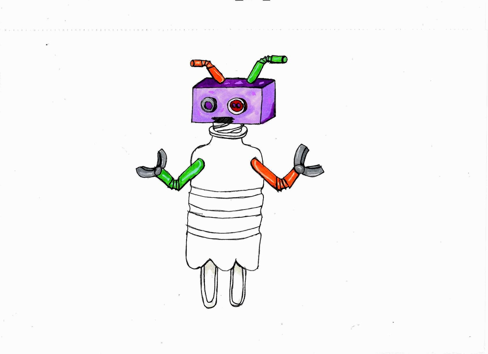
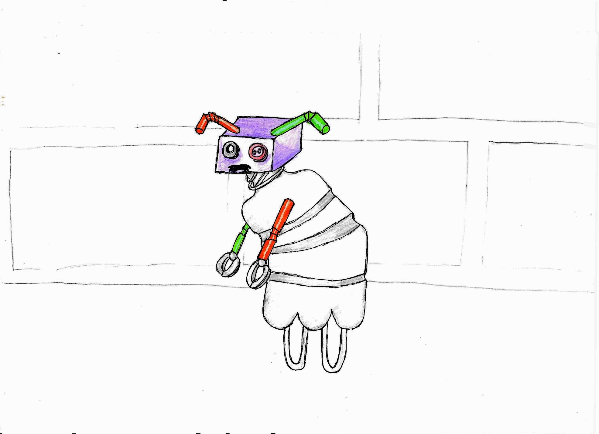
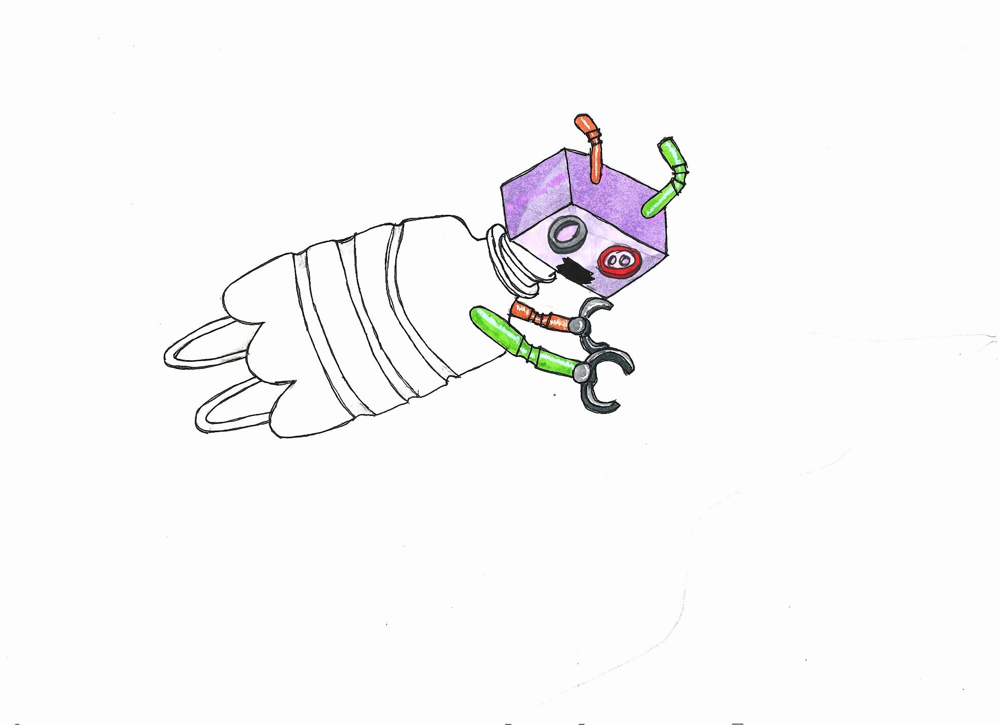
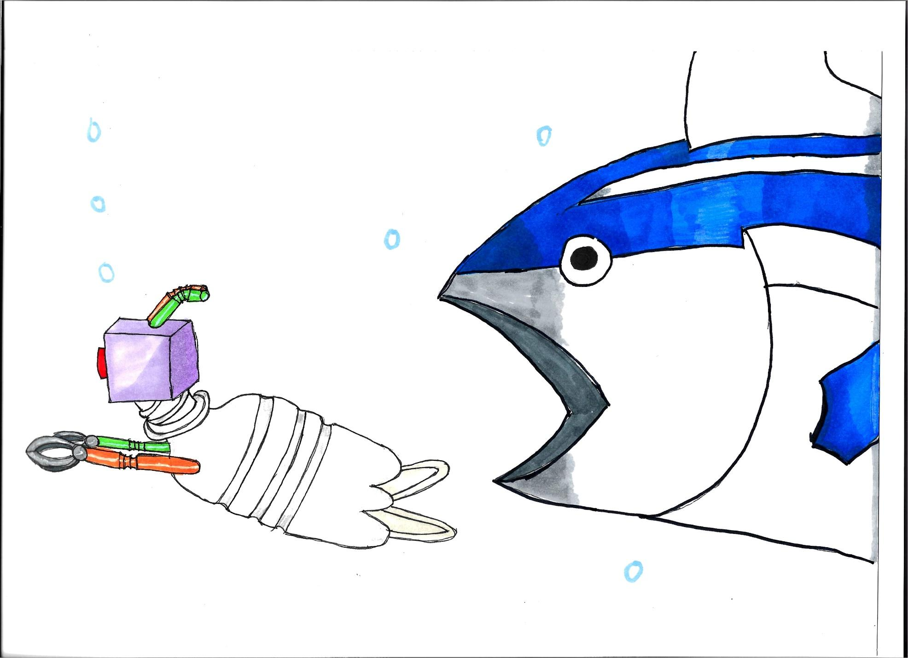
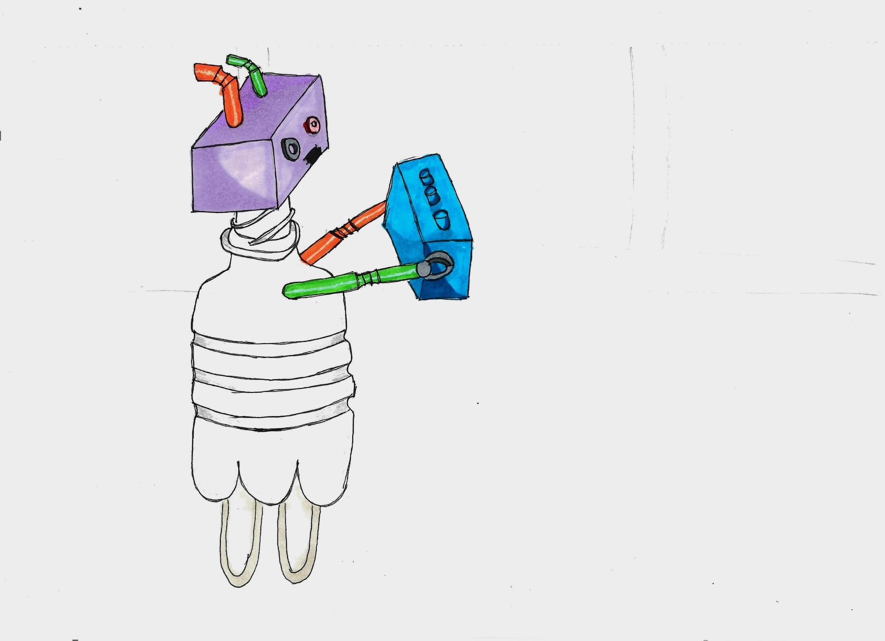
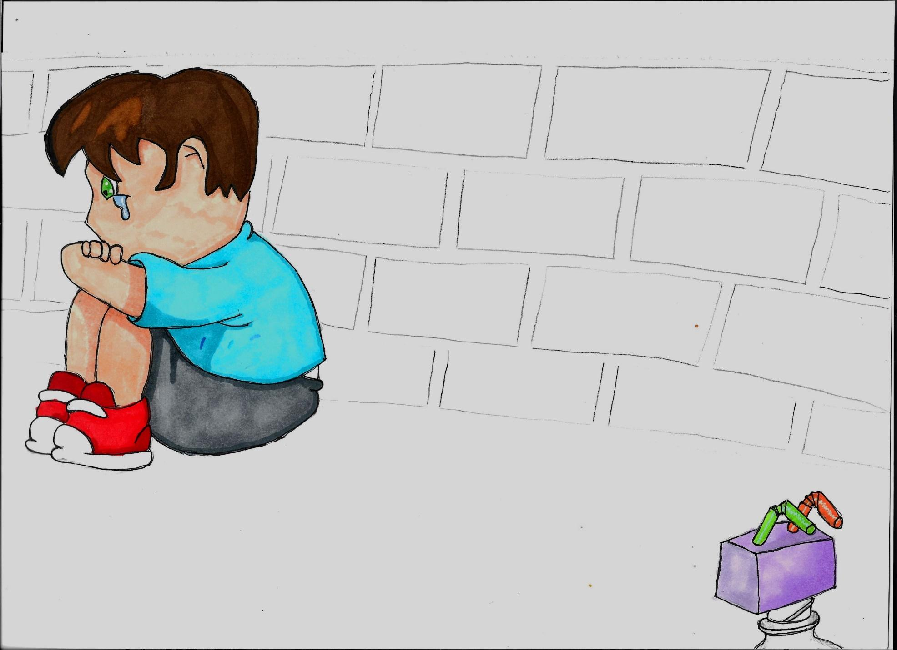
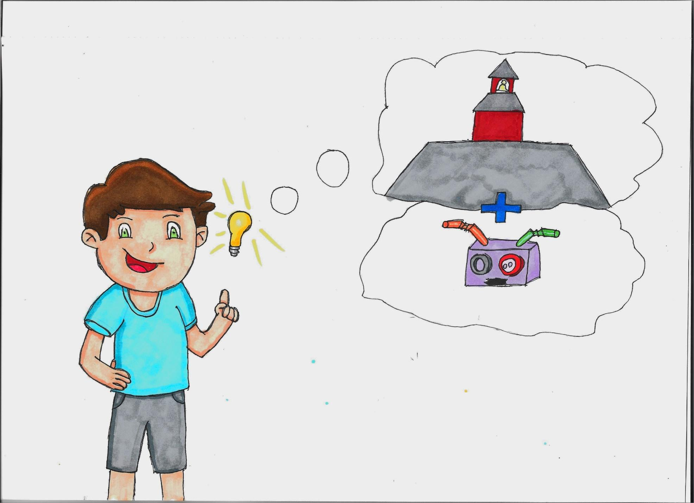
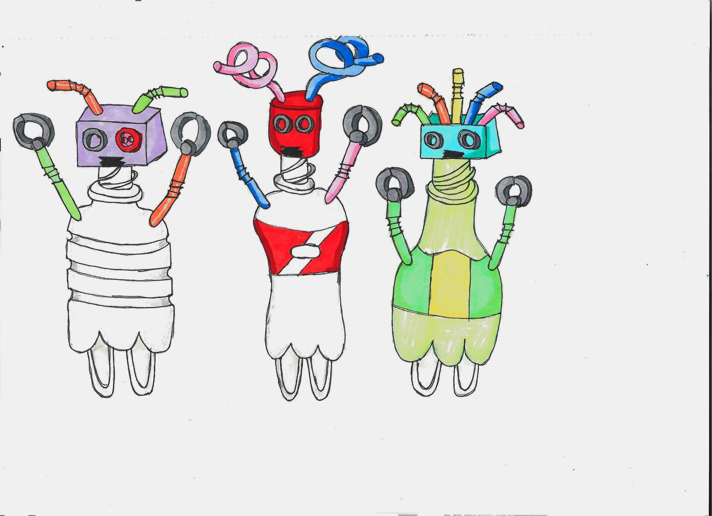

Team 11 - Final Project Modeling Appendix

About this model (relevant findings, shortcoming, etc.)

1.  Important challenge or question you envision in the design of your
    > solution, intervention, or analysis that could be informed by a
    > model

    1.  Our project is aimed at improving sustainability and climate
        > change at a local, community level. A big component of this
        > project is educating the community - while we can practice
        > sustainability in our own class project, our actions are minor
        > without promoting the same behaviors to those around us. This
        > model therefore adds the educational component to our project
        > by introducing sustainability in a fun and easy-to-understand
        > way.

2.  Description of the model itself

    1.  This model is a book focusing on a robot that learns about
        > plastic waste and wants to do something about it. This book
        > could be printed and distributed along with the plastic model
        > to develop a habit of recycling among its readers.

    2.  This model is also very important because it is half of our
        > final deliverable. We would not distribute our plastic model
        > without distributing this book along with it.

3.  Team’s main takeaways or conclusions as a result of creating the
    > model

    1.  We realized education and awareness are much more important
        > aspects of a solution than we first realized. Having a way to
        > make our product accessible to our target audience, as well as
        > entertaining, makes our solution much more effective than it
        > would be as a standalone product.

Pete the Plastic Robot

By Adam and Tyler

1

Through years and years of plastic being thrown away, eventually there
came a time where a scattering of plastics landed in such a way that
formed our dear friend, Pete the plastic robot.

Unfortunately, Pete knew that he was made from items that were
discarded, he was made from things that people didn't want any more.
That made Pete sad. 

Pete began to explore the beaches, in hopes of meeting someone to play
with him. Suddenly, a turbulent gust sent Pete somersaulting into the
ocean!

But Pete did not give up! The strong little robot swam and swam all the
way back to land and fended off the fish as he waded by! Pete finally
got to land where he thought to himself, “I'm going to make a house, so
I don't get blown away again.”

Pete Began collecting all the plastic he found on the beach and started
to make many little bricks by heating up the plastic and forming them in
molds.

He then took those little bricks, and one by one, finished his ever so
grand plastic house.

One day while taking a walk around his house, Pete noticed a boy who
seemed to be crying. “Why so blue?” asked Pete.

The boy looked up and let out a yelp of unsureness.

“Don’t worry” said Pete, “I’m Pete and I’m here to help!”

The boy smiled.

The boy said to Pete “I’m glad you’ve come by; I’ve needed a friend.”

Pete said to the boy, “I know just what to do then!”

Pete took the boy along the beaches to collect some plastic and after
some prized pieces were found, Pete and the boy got to work.

After putting a straw there and a bottle cap then, and a whosawhatsit
here and there, Pete and the boy stepped back and watched as their new
friend whirred to life! Cody sprang to life and thanked Pete and the boy
for cleaning up the beaches! 

“Thank you Thank you! I’ve always wanted to help and now that I’ve
finally been put together, I can do my part!” said Cody.

The boy then had an idea! If he took his new robot friends to class,
maybe that would get some of the kids in his classes to pick up trash
and make a robot of their own as well! 

After doing so each of his classmates seemed extremely thrilled with the
opportunity to make their own robot friend and went on a class trip to
collect all the materials they may need with Pete, (new robot), and the
boy all making sure that each student had collected the right parts (and
a bit more) to make their new friends. 

Then the 3 got to work, helping each student assemble their robots and
one by one a new recycled buddy jumped into action! A workshop of robot
friends jumped at the idea of making new friends, with each other, the
classmates, and of course, Pete, the boy, and Cody.

Then each of the robots and their new friends set out to make new
friends on the beaches so that eventually everyone would have a plastic
robot friend to help remind them that protecting our beaches is one of
the main ways to help protect our environment and the animals that live
there.

The boy took a step back and saw what he and his friend, Pete the
plastic robot had accomplished. And the boy smiled.
